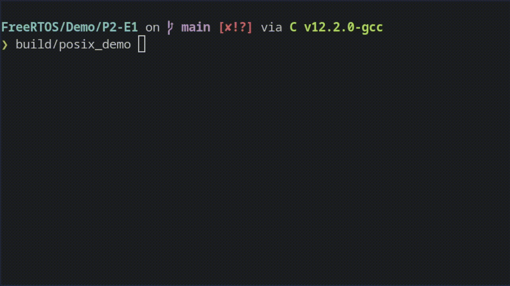
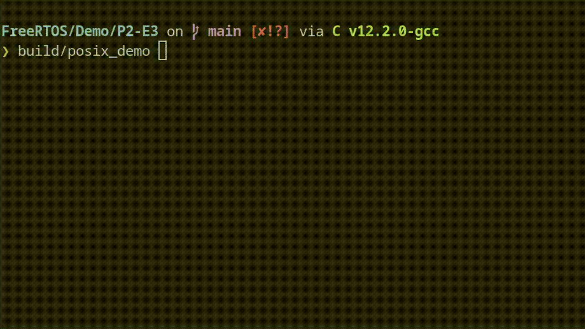

# Sistemas operativos de tiempo real - 2025 
 
# Práctica N°2 (Delays y Software Timers )

Resolucion de [Practica2.pdf](Practica2.pdf)

## Resolucion de la Practica

### [1. Delays - Uso del estado blocked para generar una demora (delay):](./P2-E1/main.c)
 
Las tareas creadas en la práctica N°1 eran de tipo periódicas, imprimen un mensaje 
en pantalla y luego ejecutan un delay repetitivamente. Los delays implementados se 
hicieron ejecutando un lazo for muy largo que no ejecuta ninguna acción (lazo nulo). 
Por supuesto que esta no es una forma útil de realizar demoras ya que las tareas 
mantienen el control mientras están ociosas.   
 
a)  Crear un clon del ejercicio 4 de la práctica N°1 
 
b)  Modificar el programa para que realice las demoras utilizando la función API 
VTaskDelay. Las demoras deben ser de 500 ms. 
 
c)  Ejecutar  y  comprobar  funcionamiento.  Hacer  captura  de  pantalla  de  la 
salida del programa. 
  
d)  **Explicar  la  diferencia  en  funcionamiento  con  respecto  al  ejercicio 
clonado.**

### Salida del Programa



##  Explicación de la diferencia en funcionamiento

| Aspecto | Versión original (`delay` con `for`) | Versión modificada (`vTaskDelay`) |
| :--- | :--- | :--- |
| **Tipo de delay** | Activo (ocupando CPU) | **Bloqueante** (libera CPU) |
| **Uso de CPU** | **Ineficiente**: la tarea sigue corriendo aunque no haga nada útil | **Eficiente**: la tarea entra en estado **Blocked** y el *scheduler* da paso a otras tareas |
| **Multitarea** | **Mala**: la tarea ociosa impide que otras tareas se ejecuten (especialmente si tiene alta prioridad) | **Buena**: permite ejecución fluida y justa entre tareas según prioridad |
| **Energía** (en sistemas reales) | **Alto consumo** (CPU activa todo el tiempo) | **Bajo consumo** (CPU puede entrar en modo bajo consumo cuando no hay tareas listas) |
| **Comportamiento observado** | Una tarea puede **monopolizar el procesador** (especialmente si tiene prioridad alta) | Tareas se **alternan armónicamente** cada 500 ms |

---

## Conclusión:

Usar `vTaskDelay()` permite una **mejor gestión del procesador**, mejora el **rendimiento del sistema** y promueve una ejecución verdaderamente **concurrente** de tareas. Es una práctica estándar en sistemas **RTOS** bien diseñados.

---

### [2. Delays - Uso de vTaskDelayUntil](./P2-E2/main.c)

Dado que la función vTaskDelay no asegura una frecuencia fija para los eventos del 
lazo (asegura una demora mínima) debe utilizarse vTaskDelayUntil para ello. 
 
a)  Clonar el ejercicio 1 
 
b)  Modificar el programa para que la cadencia del programa sea fija (de 500 
ms). 
c)  Ejecutar  y  comprobar  funcionamiento.  **Hacer  captura  de  pantalla  de  la salida del programa**.

### Salida del Programa


## Diferencia entre `vTaskDelay` y `vTaskDelayUntil`

| Función | ¿Cadencia fija? | ¿Relativa al último wake? | ¿Mejor para...? |
| :--- | :--- | :--- | :--- |
| `vTaskDelay()` | No |  Sí, relativa al momento actual | Demoras simples |
| `vTaskDelayUntil()` | Sí | No, siempre relativa a un "tick base" fijo | Tareas periódicas |


## Conclusión:

Usar `vTaskDelayUntil()` permite mantener una **frecuencia de ejecución estable**, ideal para **tareas periódicas** como sensores, actualización de pantallas o control de motores. A diferencia de `vTaskDelay()`, que solo garantiza una pausa mínima, `vTaskDelayUntil()` **corrige el tiempo de ejecución** para evitar desvíos acumulativos.

---

### [3. Delays - Tareas continuas y tareas periódicas:](./P2-E3/main.c)

En los ejercicios anteriores utilizamos tareas que nunca se bloquean (tareas continuas) 
y tareas que se bloquean (tareas periódicas) por separado. 
Ahora vamos a combinarlas para que trabajen juntas. 
 
a)  Basándose en el ejercicio anterior que más le convenga generar dos tareas 
continuas  que  impriman  un  mensaje,  sin  demoras  (lazo  nulo)  y  que  se 
ejecuten en prioridad 1.  
 
b)  Agregar  una  tercer  tarea  periódica  que  tenga  prioridad  2  usando 
vTaskDelayUntil(). Configurar su periodo de manera que permita ver dos o 
tres ejecuciones de la tarea 3 en una sola captura de pantalla. 
 
c)  Ejecutar  y  comprobar  funcionamiento.  Hacer  captura  de  pantalla  de  la 
salida del programa. 
 
d)  Según lo que puede observar entre ejecuciones de la tarea 3 **¿el sistema 
está trabajando en modo “time slice” o “run to completion”?** 


#### Salida del Programa


### Conclusión:

El sistema está trabajando en modo "time slice" para las tareas continuas de misma prioridad, ya que el scheduler les reparte el tiempo de CPU de manera equitativa (si está habilitado en `FreeRTOSConfig.h`).
La tarea periódica interrumpe a las otras al estar lista, porque tiene prioridad superior, y luego las tareas continuas siguen ejecutándose.

--- 

### [4. Software Timers - Creación de timers (“one-shot” y periódico): ](./P2-E4/main.c)

La utilización de software timers es opcional. Para habilitarlos y configurarlos deben 
setearse los siguientes parámetros (FreeRTOSConfig.h): 

```c
configUSE_TIMERS                    1 
configTIMER_TASK_PRIORITY         ( configMAX_PRIORITIES - 1 ) 
configTIMER_QUEUE_LENGTH            20 
configTIMER_TASK_STACK_DEPTH      ( configMINIMAL_STACK_SIZE * 2 ) 
```

El  primero  es  obligatorio.  Los  restantes  son  valores  propuestos  que  pueden  ser 
cambiados según la necesidad. 
Debe tenerse en cuenta que es necesario además incluir la biblioteca “timers.h”.

a)  Generar  un proyecto nuevo (copia). Configurar el uso de timers como se 
detalla en la introducción. Reemplazar el contenido del archivo main.c por la 
plantilla 2.4. 
 
b)  Ejecutar y comprobar funcionamiento. Debe ejecutarse un timer periódico de 
500 ms. 
 
c)  Usando el código de la plantilla como referencia crear un timer one shot con 
un periodo de 3,333 s. 
d)  Ejecutar  y  comprobar  funcionamiento.  Hacer  captura  de  pantalla  de  la 
salida del programa.

#### Salida del Programa


---

### [5. Software timers - Timer Reset: ](./P2-E5/main.c)
 
a)  Clonar  el  programa  del  ejercicio anterior y modificar el callback del timer 
periódico para que haga un reset del timer one shot. 
 
b)  Ejecutar  y  comprobar  funcionamiento.  Hacer  captura  de  pantalla  de  la 
salida del programa. 
 
c)  Explicar brevemente el resultado observado. 

#### Salida del Programa


El timer periódico de 500 ms ejecuta su callback antes de que transcurran los 3,333 s del one-shot. Cada vez que ocurre, llama a xTimerReset() sobre el one-shot, lo cual reinicia su cuenta de tiempo.
Como esto ocurre repetidamente, el one-shot timer nunca alcanza su tiempo de expiración, y por lo tanto su callback no se ejecuta.

---
### [6. Software timers - Simulación de un watchdog: ](./P2-E6/main.c)

Un  mecanismo  de  watchdog  es  una  rutina  de software que se dispara por tiempo 
cuando  algún  evento  que  se  esperaba  no  ocurre.  Por  ejemplo:  una  rutina que se 
supervisa no envía una señal de vida periódica (heart beat o señal de keep alive) dentro 
de un tiempo determinado. 
   
a)  Basándose en los dos ejercicios anteriores generar una rutina que envíe un 
heartbeat  (impresión en pantalla) y resetee un watchdog. Si este pasa un 
tiempo mayor a 4 señales de vida perdídas debe activarse. 
 
b)  Ejecutar  y  comprobar  funcionamiento.  Hacer  captura  de  pantalla  de  la 
salida del programa. 
 
c)  Simular una falla en el envío de señal de vida después de 10 ciclos, ejecutar 
y comprobar funcionamiento. Hacer captura de pantalla de la salida del 
programa


#### Salida del Programa
