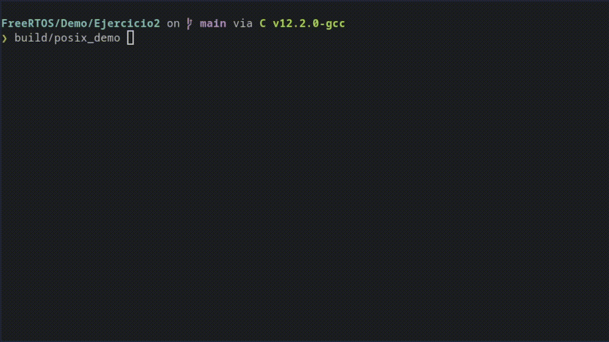
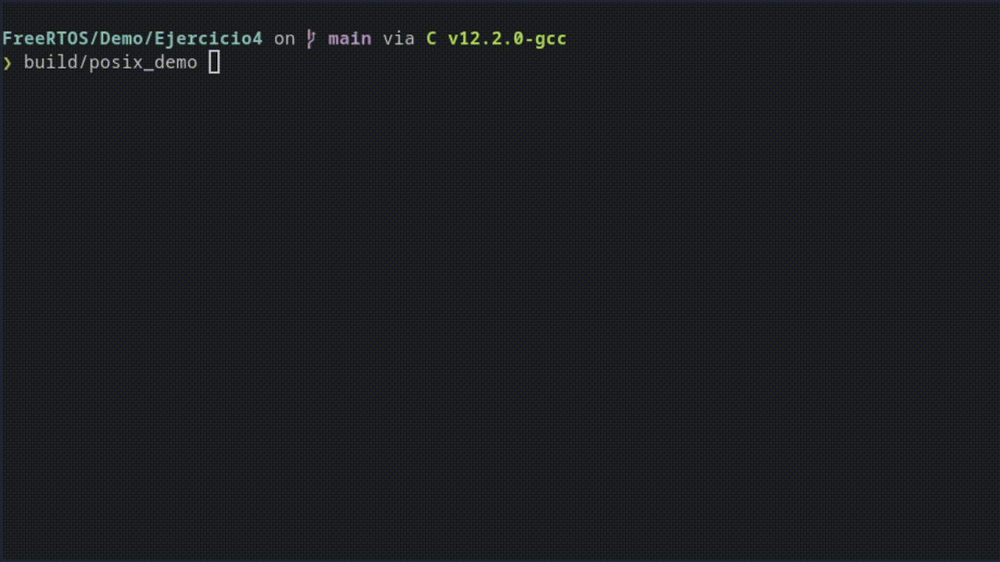
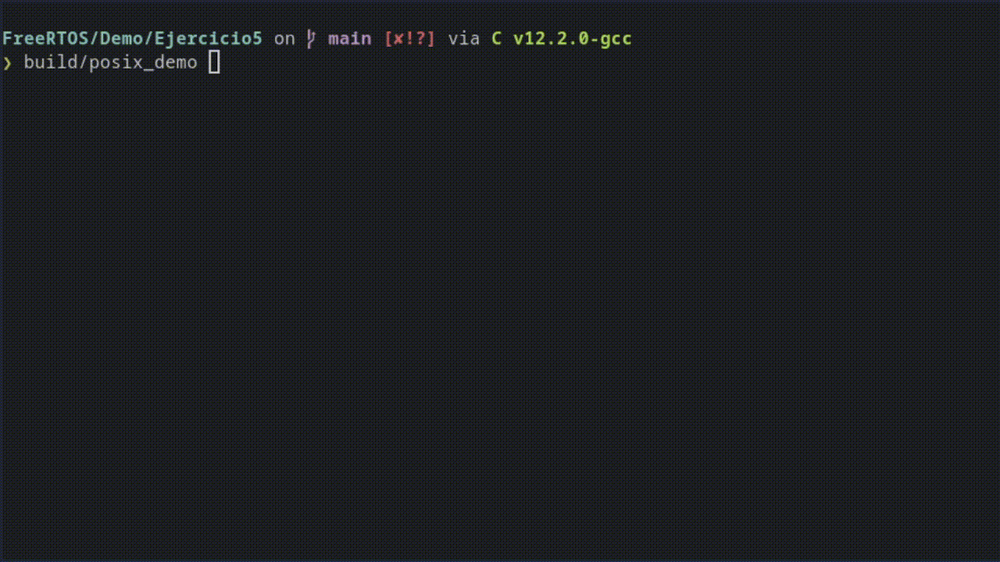
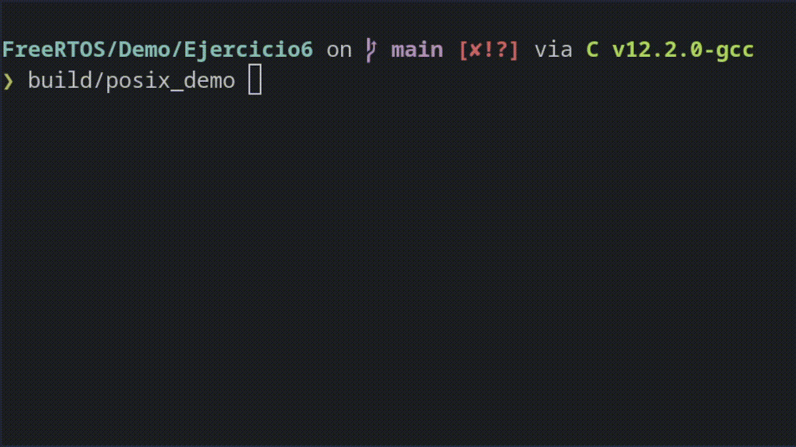

# Sistemas operativos de tiempo real - 2025 
 
# Práctica N°1 (Versión 2)

Resolucion de [Practica1.pdf](Practica1.pdf)

## Resolucion de la Practica

### [1. Creación de tareas (desde main):](./Ejercicio1/main.c)
 
a)  Crear un clon del proyecto Hola_mundo generado en las actividades previas. 
 
b)  Reemplazar el código del archivo main.c por el de la Plantilla 1_1. 
 
c)  Reemplazar el código del archivo FreeRTOSConfig.h por el de 
    FreeRTOSConfig.h 1_1. Analizar el código pegado. 
 
d)  Ejecutar y comprobar funcionamiento. Realizar correcciones de ser 
    necesarias. 
 
e)  Modificar para crear otra tarea adicional igual a la primera pero que imprima 
    un mensaje distinto. 
 
f)  Ejecutar y comprobar funcionamiento. **Hacer captura de pantalla de la salida del programa**. 
 
g)  **Explicar en qué consiste la corrección que debió realizarse**

### Salida del Programa


La corrección fue declarar la función de la tarea `(vTask1)` antesde su uso en `xTaskCreate()`, o sea agregar su prototipo o mover sudefinición por encima del `main()`.

---

### [2. Creación de tareas (desde tarea):](./Ejercicio2/main.c)

a)  Clonar el programa del ejercicio 1 
 
b)  Modificar para que la tarea 2 se cree dentro de la tarea 1  
  
c)  Ejecutar y comprobar funcionamiento. **Hacer captura de pantalla de la salida del programa**.

### Salida del Programa


Fragmento de codigo donde se crea la `tarea 2` dentro de la `tarea 1`

```c
/* Funcion de Task1 */
void vTask1(void* pvParameters)
{
    const char* pcTaskName = "Tarea 1 ejecutando \r\n";
    volatile uint32_t ul;
    
    /* Crear la tarea 2 desde dentro de la tarea 1 */
    xTaskCreate(vTask2, "Task 2", 1000, NULL, 1, NULL);

    /* ... Resto del codigo*/
}

/* Funcion de Task2 */
void vTask2(void* pvParameters)
{
    const char* pcTaskName = "Tarea 2 ejecutando \r\n";
    /* ... Resto del codigo*/
}
```
---

### [3. Uso de los parámetros de tareas: ](./Ejercicio3/main.c)

Debe notarse que en los ejercicios anteriores ambas tareas ejecutan casi el mismo proceso, a excepción del mensaje que imprime cada tarea. Se puede mejorar el código evitando escribir dos veces el mismo proceso. para ello deben utilizarse los parámetros de tarea.   
 
a)  Clonar el ejercicio 1 
 
b)  Eliminar la función que implementa la tarea 2 
 
c)  Modificar el código para que ambas funciones se creen con una sola tarea, 
teniendo en cuenta que ambas tareas deben imprimir mensajes distintos 
(usar parámetros). 
 
d)  Ejecutar y comprobar funcionamiento. Hacer captura de pantalla de la 
salida del programa


#### Salida del Programa


Creacion de Funcion `vTaskWithParam` que imprime un mensaje recibido como parámetro

```c
void vTaskWithParam(void *pvParameters)
{
    const char *pcTaskName = (const char *)pvParameters;
    volatile uint32_t ul;

    for (;;)
    {
        vPrintString(pcTaskName);

        for (ul = 0; ul < mainDELAY_LOOP_COUNT; ul++) { }
    }
}

```

Implementacion en `main()`
```c
int main(void)
{
    /* Mensajes distintos para cada tarea */
    const char* msg1 = "Tarea 1 ejecutando \r\n";
    const char* msg2 = "Tarea 2 ejecutando \r\n";

    /* Creación de la primera tarea usando parámetro */
    xTaskCreate(vTaskWithParam, "Task 1", 1000, (void*)msg1, 1, NULL);

    /* Creación de la segunda tarea usando parámetro */
    xTaskCreate(vTaskWithParam, "Task 2", 1000, (void*)msg2, 1, NULL);


    /* ... Resto del codigo */
}
```

--- 

### [4. Experimentando con prioridades:  ](./Ejercicio4/main.c)

a)  Basándose en el ejercicio anterior, modificar para que las dos tareas corran a 
distintas prioridades. 
 
b)  Ejecutar y comprobar funcionamiento. Hacer captura de pantalla de la 
salida del programa. 
 
c)  Contestar las siguientes preguntas: 
- Describa brevemente el funcionamiento del programa. 
- Explique las causas de este funcionamiento. 
- Según su criterio ¿Esta forma de funcionar podría tener utilidad?


#### Salida del Programa



#### 1. Describa brevemente el funcionamiento del programa:
El programa crea dos tareas que imprimen mensajes en bucle infinito. Cada tarea tiene una prioridad distinta, lo que hace que el **scheduler de FreeRTOS** ejecute preferentemente **la tarea de mayor prioridad**.

#### 2. Explique las causas de este funcionamiento:
FreeRTOS utiliza un scheduler preemptivo basado en prioridades.

La **tarea de mayor prioridad (Tarea 1)** siempre se ejecuta primero si está lista.

La **tarea de menor prioridad (Tarea 2)** solo se ejecuta cuando la tarea de mayor prioridad está bloqueada o cede voluntariamente la CPU.

```c
/* Tarea 1: prioridad alta */
xTaskCreate(vTaskWithParam, "Task 1", 1000, "Mensaje Tarea 1\n", 2, NULL);

/* Tarea 2: prioridad baja */
xTaskCreate(vTaskWithParam, "Task 2", 1000, "Mensaje Tarea 2\n", 1, NULL);
```
En este ejemplo la Tarea 1 consume más CPU, por lo que la Tarea 2 se ejecuta menos frecuentemente.


#### 3. Según su criterio, ¿esta forma de funcionar podría tener utilidad?:
Sí. La asignación de prioridades es muy útil en sistemas tiempo real, donde ciertas tareas críticas deben ejecutarse antes que otras menos importantes.
Por ejemplo:

    Control de sensores y actuadores críticos → alta prioridad

    Tareas de logging o comunicación → baja prioridad

Esto permite garantizar que las tareas más importantes respondan primero, asegurando estabilidad y cumplimiento de los plazos en sistemas embebidos.

---

### [5. Cambiando prioridades (Dinamicas): ](./Ejercicio5/main.c)
 
a)  Generar un clon del programa del ejercicio anterior  
 
b)  Modificar para que ambas tareas funcionen (pista: utilizar alguna función de 
la API de FreeRTOS no utilizada hasta acá). 
 
c)  Utilizando algún parámetro global (#define) asegurar que las tareas se 
ejecutan del siguiente modo: 
 
| **Tarea**   | **Opción 1** (80%-20%) | **Opción 2** (50%-50%) | **Opción 3** (30%-70%) |
|------------|-----------------------|-----------------------|-----------------------|
| **Tarea 1** | 80%                   | 50%                   | 30%                   |
| **Tarea 2** | 20%                   | 50%                   | 70%                   |

 
d)  Ejecutar y comprobar funcionamiento. Hacer captura de pantalla de la 
salida del programa para cada opción.

#### Salida del Programa


#### Opcion 1: Tarea 1 > 80% del tiempo, Tarea 2 > 20% del tiempo 


#### Opcion 2: Tarea 1 > 50% del tiempo, Tarea 2 > 50% del tiempo 


#### Opcion 3: 30% del tiempo, Tarea 2 > 70% del tiempo 



Parámetro global **TASK1_RATIO**:


```c
#define TASK1_RATIO 80
```

permite cambiar fácilmente la proporción de tiempo de ejecución sin recompilar toda la lógica.

Se usan handles de tareas:

```c
TaskHandle_t task1Handle, task2Handle;
```

para cambiar prioridades en tiempo de ejecución usando vTaskPrioritySet().

Se implementa un switch según `TASK1_RATIO` para ajustar dinámicamente.

Implementacion dentro de main:

```c
/* Ajustar prioridades según TASK1_RATIO */
    switch(TASK1_RATIO)
    {
        case 80: // Tarea 1 80%, Tarea 2 20%
            vTaskPrioritySet(task1Handle, 3);
            vTaskPrioritySet(task2Handle, 1);
            break;
        case 50: // 50% - 50%
            vTaskPrioritySet(task1Handle, 2);
            vTaskPrioritySet(task2Handle, 2);
            break;
        case 30: // Tarea 1 30%, Tarea 2 70%
            vTaskPrioritySet(task1Handle, 1);
            vTaskPrioritySet(task2Handle, 3);
            break;
        default:
            /* Por defecto: igual prioridad */
            vTaskPrioritySet(task1Handle, 2);
            vTaskPrioritySet(task2Handle, 2);
            break;
    }
```

**Nota:** Para la correcta compilación del programa, se deben habilitar en `FreeRTOSConfig.h` las siguientes macros:

```c
#define INCLUDE_vTaskPrioritySet                  1
#define INCLUDE_uxTaskPriorityGet                 1
#define INCLUDE_vTaskDelete                       1
```

---
### [6. Borrando tareas ](./Ejercicio6/main.c)

a)  Basándose en el ejercicio anterior (versión 80% - 20%), hacer que la tarea 2 
se ejecute un número determinado de veces (parámetro de programa) y 
luego se borre.   
 
b)  Ejecutar y comprobar funcionamiento. Hacer captura de pantalla de la 
salida del programa.


#### Salida del Programa

#### Opcion 3: 30% del tiempo, Tarea 2 > 70% del tiempo 


#### Ejecución limitada de Tarea 2
La Tarea 2 se ejecuta 15 veces (en este caso) y luego se borra automáticamente.

Parametro:
```c
#define TASK2_RUN_COUNT 15
```

**Nota:** Para la correcta compilación del programa, se deben habilitar en `FreeRTOSConfig.h` las siguientes macros:

```c
#define INCLUDE_vTaskPrioritySet                  1
#define INCLUDE_uxTaskPriorityGet                 1
#define INCLUDE_vTaskDelete                       1
```